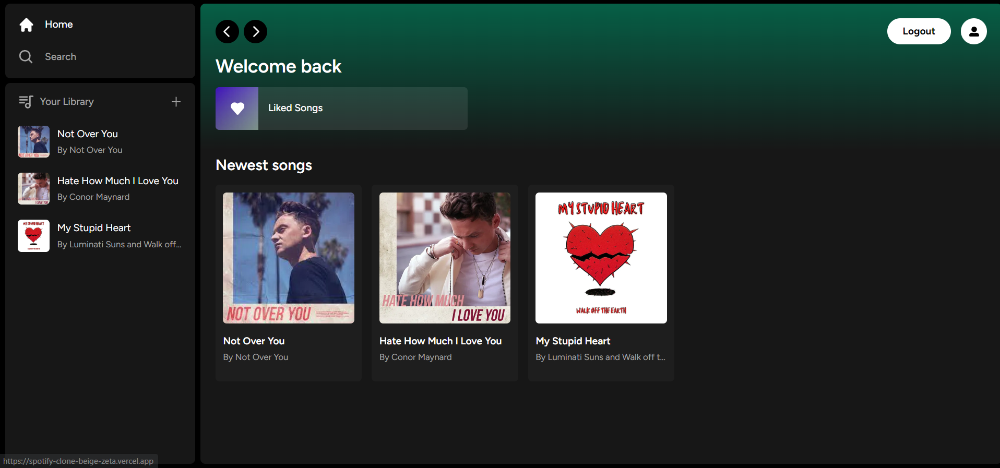
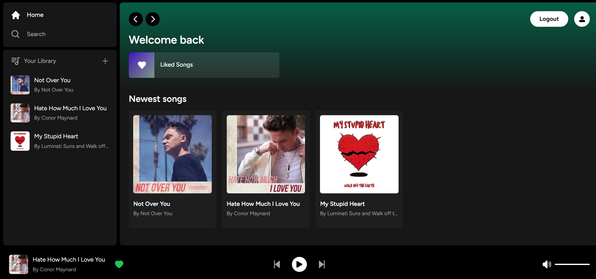

# Full Stack Spotify Clone with Next.js 13.4 App Router: React, Tailwind, Supabase, PostgreSQL, Stripe

This repository is a full stack Spotify clone built with Next.js, React, Tailwind CSS, Supabase, PostgreSQL, and Stripe. It replicates the core features of Spotify and includes additional functionalities such as song upload, Stripe integration for payments, Tailwind design for a sleek user interface, and more.




## Key Features

- **Song Upload**: Users can upload their own songs to the platform.
- **Stripe Integration**: Seamless integration with Stripe for secure and convenient payment processing.
- **Tailwind Design**: The user interface is designed using Tailwind CSS, providing a modern and visually appealing experience.
- **Tailwind Animations and Transition Effects**: Animations and transitions are implemented using Tailwind CSS to enhance the overall user experience.
- **Full Responsiveness**: The application is fully responsive and optimized for all devices, ensuring a consistent experience across different screen sizes.
- **Credential Authentication with Supabase**: Users can sign up, log in, and authenticate their credentials using Supabase, a powerful open-source Firebase alternative.
- **Github Authentication Integration**: Users have the option to authenticate using their Github accounts.
- **File and Image Upload using Supabase Storage**: Users can upload files and images, which are stored securely in Supabase storage.
- **Client Form Validation and Handling with react-hook-form**: The application utilizes react-hook-form for efficient client-side form validation and handling.
- **Server Error Handling with react-toast**: Errors and exceptions on the server-side are gracefully handled using the react-toast library.
- **Play Song Audio**: Users can play the uploaded songs within the application.
- **Favorites System**: Users can mark songs as favorites and easily access them later.
- **Playlists / Liked Songs System**: Users can create playlists and manage their liked songs.
- **Advanced Player Component**: The application includes an advanced player component with features such as play, pause, skip, and volume control.
- **Stripe Recurring Payment Integration (Not Fully Functional)**: Integration with Stripe for recurring payments, although this functionality is not fully implemented.
- **POST, GET, and DELETE Routes**: Demonstrates how to write route handlers for handling POST, GET, and DELETE requests.
- **Fetch Data in Server React Components**: Shows how to fetch data directly from the database in server React components, without using APIs.
- **Handling Relations between Server and Child Components**: Demonstrates how to manage relationships between server-side components and child components in a real-time environment.
- **Cancelling Stripe Subscriptions (Not Functional)**: Includes the option to cancel Stripe subscriptions, although this functionality is not fully implemented.

## Prerequisites

- **Node version 14.x**: Make sure you have Node.js version 14.x or later installed on your system.

## Installation

1. Clone the repository to your local machine.

2. Install the required packages by running the following command in your terminal:

   ```shell
   npm install

3. Set up the .env file with the required environment variables. These variables include the Supabase URL, Supabase anonymous key, Supabase service role key, Stripe publishable key, Stripe secret key, and Stripe webhook secret.

4. Create the necessary SQL tables by executing the queries in the database.sql file. This file contains the schema for the songs and liked_songs tables. You can also refer to the accompanying video tutorial for guidance.

5. Start the application by running the following command:
   ```shell
   npm run dev

## To start the project

    ```shell
    npm run dev
